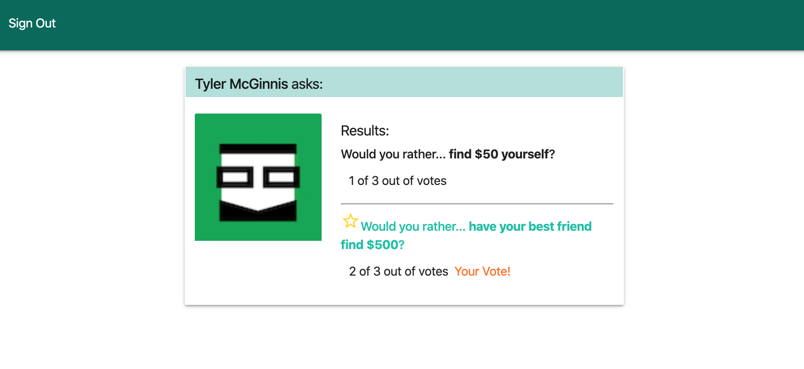

# Would You Rather Project

The 'Would you rather...' application was developed as part of the Udacity React Nanodegree Program.

The application is a little game where users can anser 'Would you rather...'-type questions, see how their answers compare to other users, and also create new questions.

Currently, there is no database at the backend of this application however.
All the data comes from the `src/utils/_DATA.js` file, which represents a fake database.

## Installing the App
### Node and NPM
This application was developed using Node.js, version v13.11.0.  
Just go to the [official Node.js website](https://nodejs.org/) and download the installer.
Also, be sure to have `git` available in your PATH, `npm` might need it (You can find git [here](https://git-scm.com/)).

### 'Would you Rather' Application
* Clone or download this project: `git clone https://github.com/hdatteln/reactnd-project-would-you-rather.git` 
* In the project's root directory, run `npm install` to install the required packages

## Running the App
* In the project's root directory, run `npm start` to start the application.
* A new browser window should automatically open and display the app. If it doesn't, navigate to http://localhost:3000/ in your browser.

## Using the App
### Sign in Page (http://localhost:3000/)
This is a mocked sign-up page; It does not provide a security layer for the app, but it currently allows you to select from a list of users so you can use the app as one of those users.

  

### Home Dashboard (http://localhost:3000/)
The home dashboard shows you a list of all available questions, grouped in two tabs:
* Unanswered questions - Displayed by default. These are questions that the signed-in user has not answered yet.
* Answered questions -  These are questions that the signed-in user has already answered.

Each question has a button that allows you to:
a) answer an unanswered question, OR  
b) see the details of an already answered question

  

  

  

### New Question (http://localhost:3000/add)
Click 'New Question' in the navigation bar to add a new question.  
Enter the two different options you want to ask about, and click 'Submit'.

  

### Leaderboard (http://localhost:3000/leaderboard)
The leaderboard shows you a ranking of all users;
Users can gain ranking points by submitting or answering questions

  

## Data Details
There are two types of objects stored in our fake database:

* Users
* Questions

### Users
Users include:

| Attribute    | Type             | Description           |
|-----------------|------------------|-------------------         |
| id                 | String           | The user’s unique identifier |
| name          | String           | The user’s first name  and last name     |
| avatarURL  | String           | The path to the image file |
| questions | Array | A list of ids of the polling questions this user created|
| answers      | Object         |  The object's keys are the ids of each question this user answered. The value of each key is the answer the user selected. It can be either `'optionOne'` or `'optionTwo'` since each question has two options.

### Questions
Questions include:

| Attribute | Type | Description |
|-----------------|------------------|-------------------|
| id                  | String | The question’s unique identifier |
| author        | String | The author’s unique identifier |
| timestamp | String | The time when the question was created|
| optionOne | Object | The first voting option|
| optionTwo | Object | The second voting option|

### Voting Options
Voting options are attached to questions. They include:

| Attribute | Type | Description |
|-----------------|------------------|-------------------|
| votes             | Array | A list that contains the id of each user who voted for that option|
| text                | String | The text of the option |

